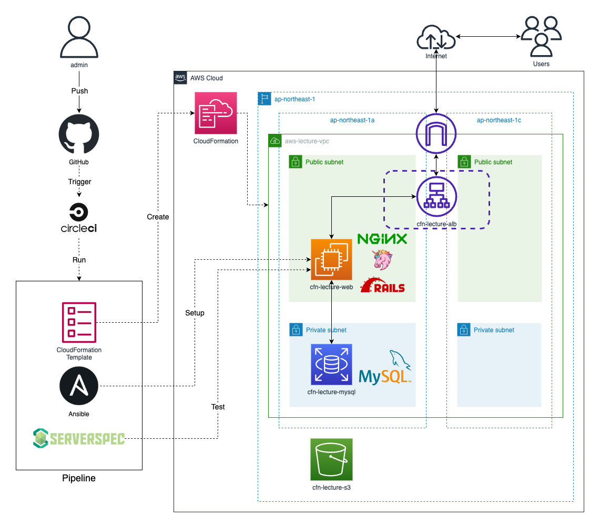

# RaiseTech

## 概要
- RaiseTechのAWSフルコース課題提出用リポジトリ

## 構成
|ファイル・ディレクトリ|説明|補足|
|:--:|:--|:--|
|.circleci/|CircleCIの設定ファイルを保管|第12回以降の課題で使用|
|ansible/|AnsibleのPlaybookを保管|第13回の課題で使用|
|cloudformation/|CloudFormationのテンプレートファイルを保管|第10回以降の課題で使用|
|images/|各回課題報告資料の画像ファイルを保管||
|serverspec/|Serverspecのテストスクリプトを保管|第11回以降の課題で使用|
|sshconfig/|CircleCIで使用するSSH用configを保管|
|lecture〜.md|各回課題提出資料||
|README.md|当ファイル。リポジトリの説明||

## 各講座の課題内容
|講座|課題内容|課題報告ファイル|
|:--:|:--|:--|
|第1回|AWSアカウント作成 / IAM の推奨設定 / Cloud9の作成|-|
|第2回|GitHubアカウント作成 / Git設定 / Pull Request|lecture02.md|
|第3回|サンプルアプリケーションのデプロイ / APサーバー、DBサーバー、Railsの構成管理ツールについて|lecture03.md|
|第4回|AWS上にVPC、EC2、RDSの作成|lecture04.md|
|第5回|Nginx、Unicornの構成でサンプルアプリケーションのデプロイ / ELB、S3の追加 / 構成図の作成|lecture05.md|
|第6回|CloudTrailのイベントを確認 / CloudWatchアラームのメール通知設定 / AWS利用料の見積もり作成|lecture06.md|
|第7回|前回までの課題で作成した環境の脆弱性について|lecture07.md|
|第8回|ー|-|
|第9回|ー|-|
|第10回|AWS環境のコード化（CloudFormation）|lecture10.md|
|第11回|ServerSpecのテスト|lecture11.md|
|第12回|CircleCIのサンプルコンフィグの組み込み|lecture12.md|
|第13回|CircleCIのサンプルにServerSpecやAnsibleの処理を追加|lecture13-14.md|
|第14回|AWS構成図、自動化処理がわかる図、リポジトリの README作成|lecture13-14.md|
|第15回|ー|-|
|第16回|ー|-|

## 参考情報
### 最終成果物の構成図（第13、14回課題で作成）

### 最終成果物で工夫した点
- 課題環境以外でも簡単に試せるように、以下の点を工夫した
    - 必要な環境変数はCircleCIの `Environment Variables` に設定することで、コード変更を不要とした
    - CircleCIからEC2へのSSH接続に必要な情報は `sshconfig/config` に記載し実行時 `~/.ssh` にコピーする構成とし、IPアドレス変更の手間を軽減させた
    - Serverspecのホスト名を`sshconfig/config`に設定することで、フォルダ名変更を不要とした
- 第4,5回課題において手動で実施した内容をコード化することで、手動とコード化を比較・検証できるようにした
