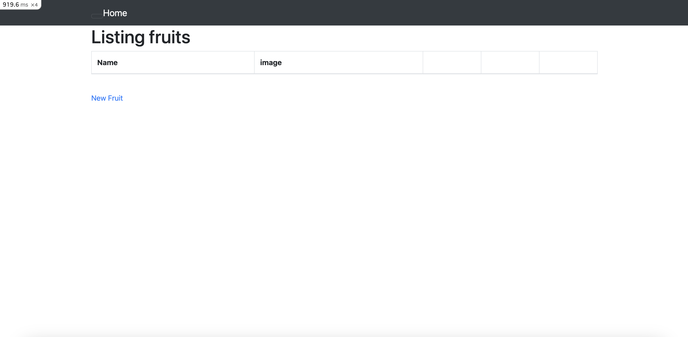
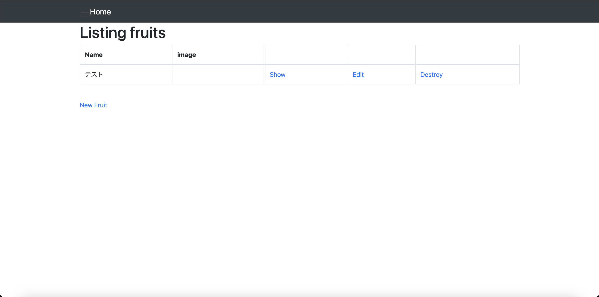
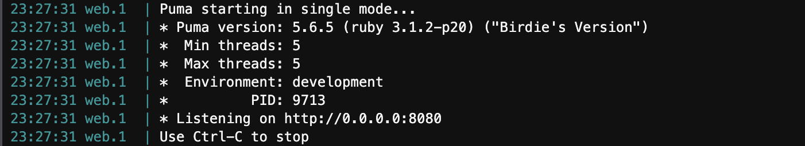
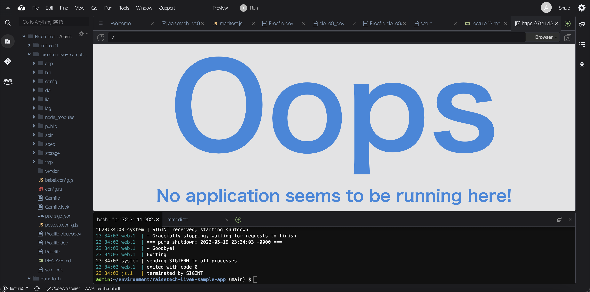
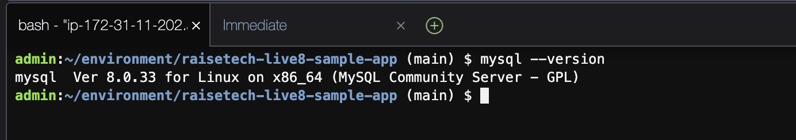
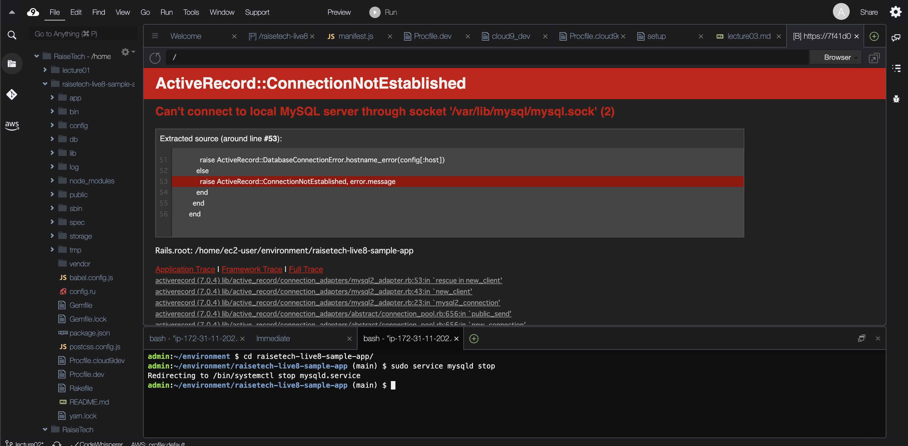
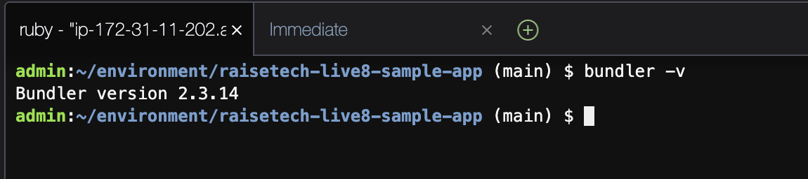

# 第３回課題

## サンプルアプリケーションを起動（デプロイ）し、ブラウザでアクセスする
- ブラウザでアクセスし、サンプルアプリケーションが起動していることを確認

- New Fluitから入力し反映されることを確認

## APサーバーについて調べる
### APサーバーの名前とバージョンを確認する
- APサーバー起動時のメッセージで名前とバージョンを確認

### APサーバーを終了させた場合、引き続きアクセスできるか確認する
- APサーバー終了後にアクセスすると、サンプルアプリケーションの画面が表示されないことを確認

## DBサーバーについて調べる
### DBサーバー（DBエンジン）の名前とバージョンを確認する
- コマンドでDBサーバー（DBエンジン）の名前とバージョンを確認

### DBサーバーを終了させた場合、引き続きアクセスできるか確認する
- DBサーバー終了後にアクセスすると、エラー画面が表示されることを確認

## Railsの構成管理ツールの名前を確認する
- Railsの構成管理ツールの名前は「Bundler」
- コマンドでバージョンを確認

## 今回の課題から学んだことを報告する
- Webのアプリケーションを起動するために必要な手順を学んだ
- 多くの技術要素、今回だと「Rails」「Bundler」「MySQL」などがあり幅広い知識が求められる
- エラーに対応するためには各手順の意味をある程度理解しておく必要がある
