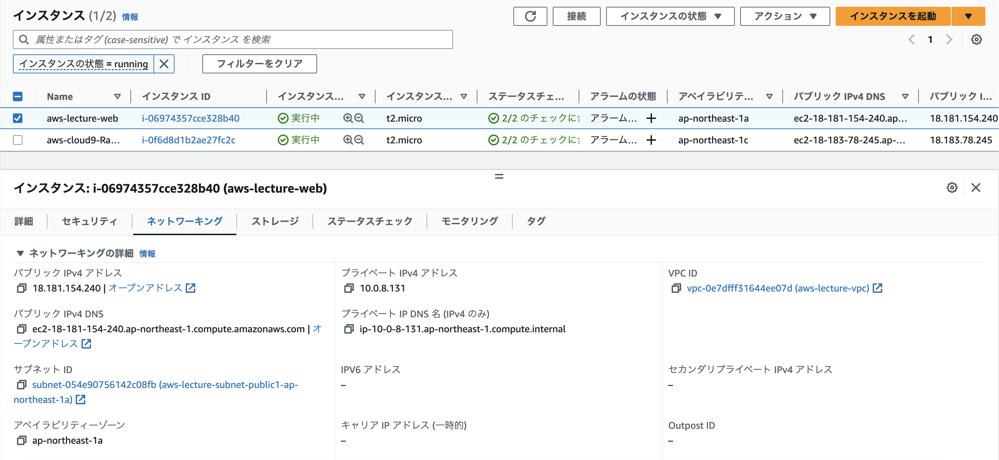

# 第4回課題

## AWS上に新しくVPCを作成する
- 新しくVPCが作成されていることを確認

## EC2とRDSを構築する
### EC2を構築する
- EC2が作成したVPC上に構築されていることを確認

### RDSを構築する
- RDSが作成したVPC上に構築されていることを確認

## EC2からRDSへ接続し正常であることを確認する
- EC2にSSH接続後、EC2からRDSへ接続できることを確認

## 今回の課題から学んだことを報告する
- サーバやDBがウィザードだけで簡単に作成できたことに改めて驚いた
- 特にインターネットにつながるネットワークがAWSにほぼお任せでできることに驚き
- 次はサブネットやセキュリティグループを自分で作成後に関連付けてみて理解を深めたい
