# 第5回課題

## EC2上にサンプルアプリケーションをデプロイして、動作させる
### 組み込みサーバーだけで動作させる
1. 〜
- 〜を確認

- New Fruitから入力し反映されることを確認
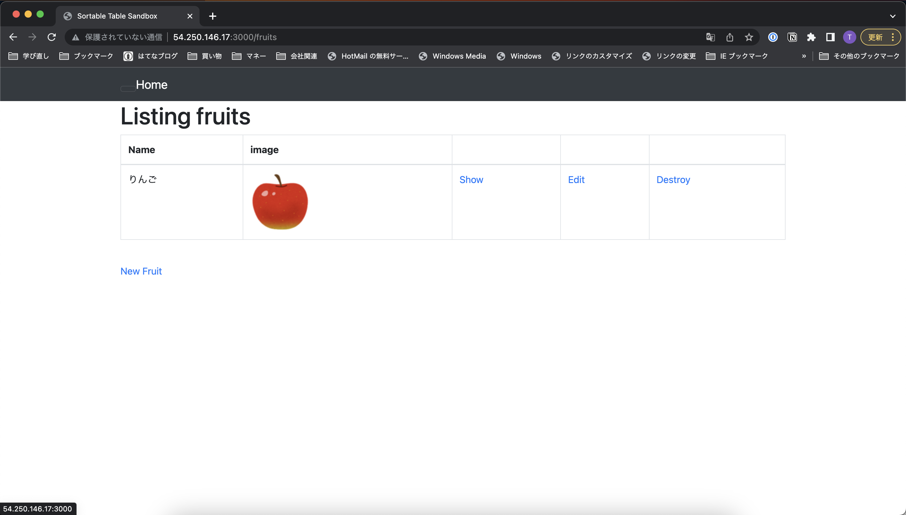

### サーバーアプリケーションを分ける

- Nginxが起動していることを確認
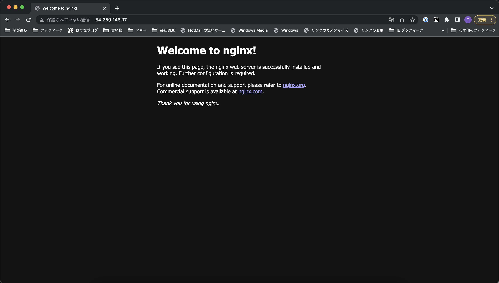

- New Fruitから入力し反映されることを確認
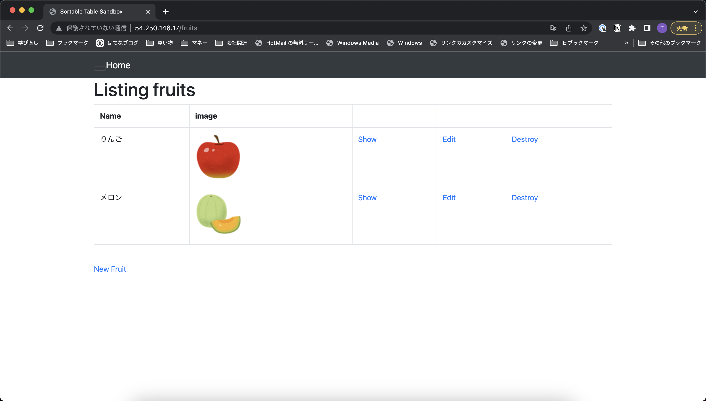

## ELB(ALB)を追加する
1. ELB(ALB)を作成する
    - ELB(ALB)が作成されていることを確認
    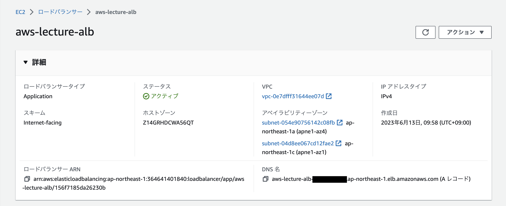
    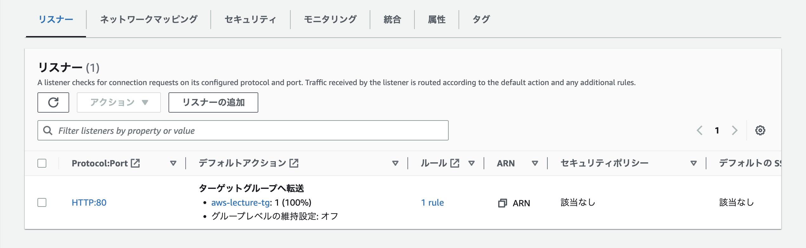
    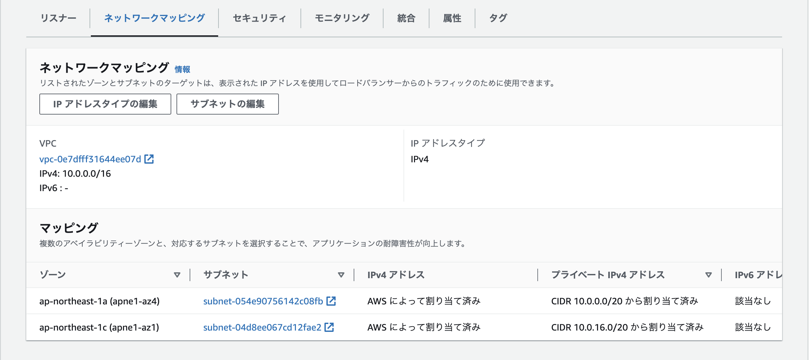
    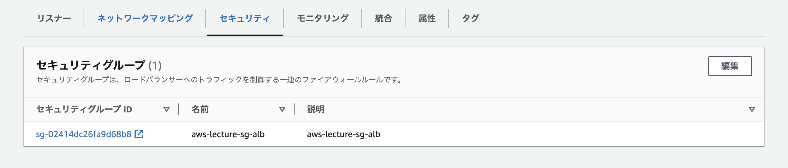
    - ELB(ALB)のターゲットグループを確認
    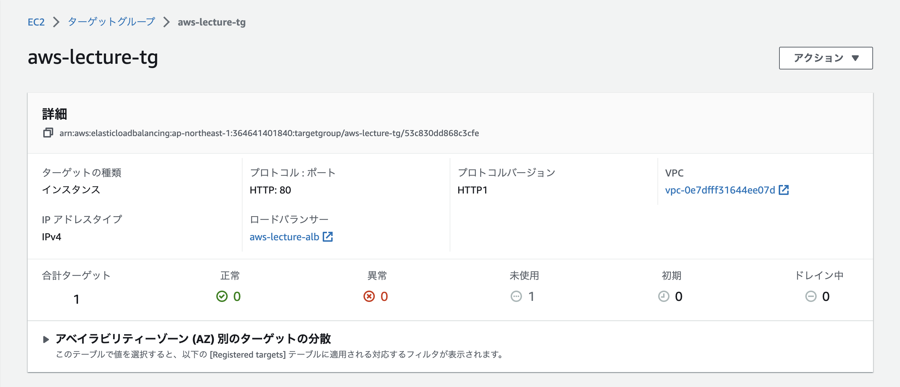
    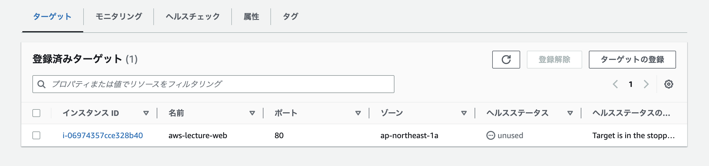
    - ELB(ALB)のセキュリティグループを確認
    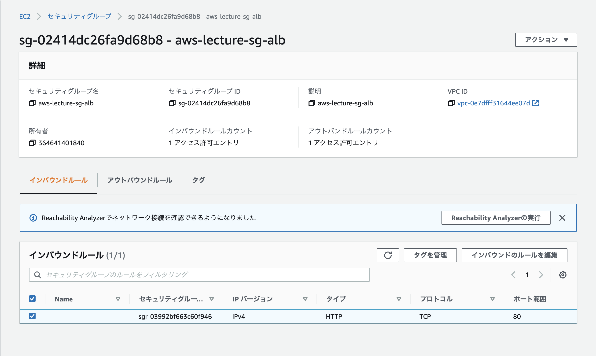

2. (development.rbにDNS名を追加)

3. ELB(ALB)のDNS名でアクセスできるか確認する
    - DNS名でアクセスし、New Fruitから入力し反映されることを確認
    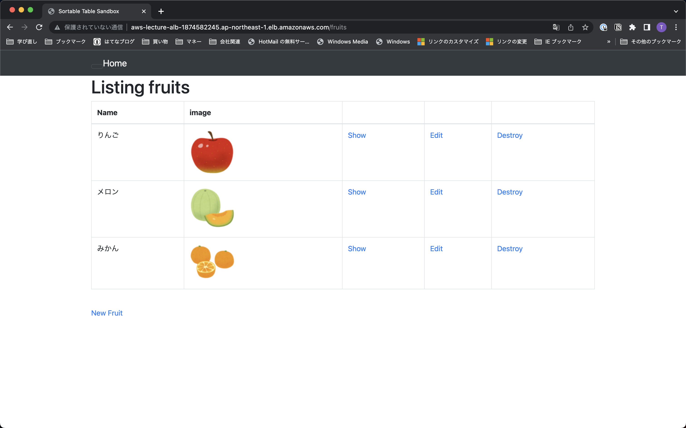

## S3を追加する
1. バケットを作成する
    - バケットが作成されていることを確認
    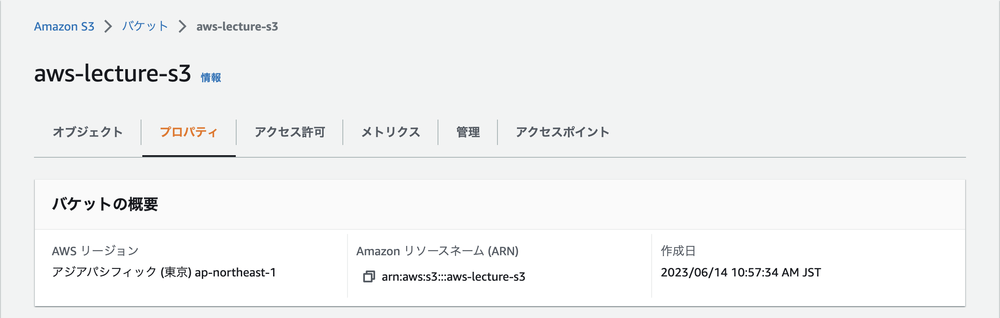

2. S3にアクセスするためのIAMユーザーを作成する
    - IAMユーザーを作成しアクセスキーが作成されていることを確認
    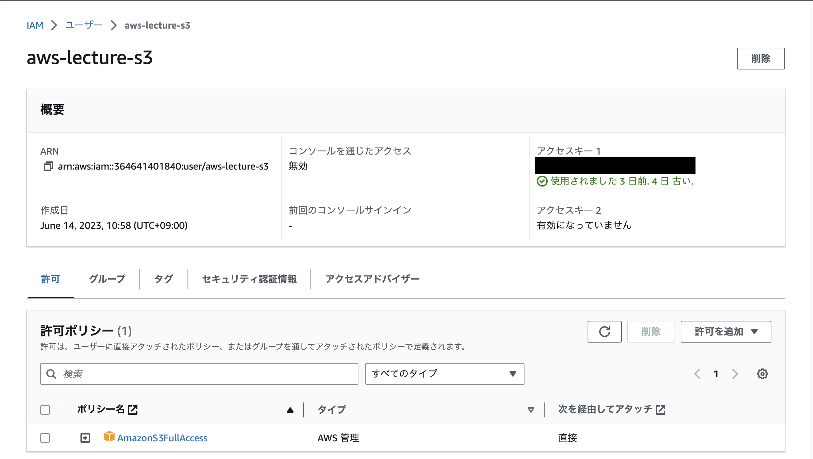

3. Railsの設定を変更する
    - サンプルアプリケーションのGemfileに`aws-sdk-s3`が記述されていることを確認
    - 秘匿情報に作成したアクセスキーを設定する

5. New Fruitから入力し反映され、バケットに保存されていることを確認する
    - New Fruitから入力し反映されることを確認
    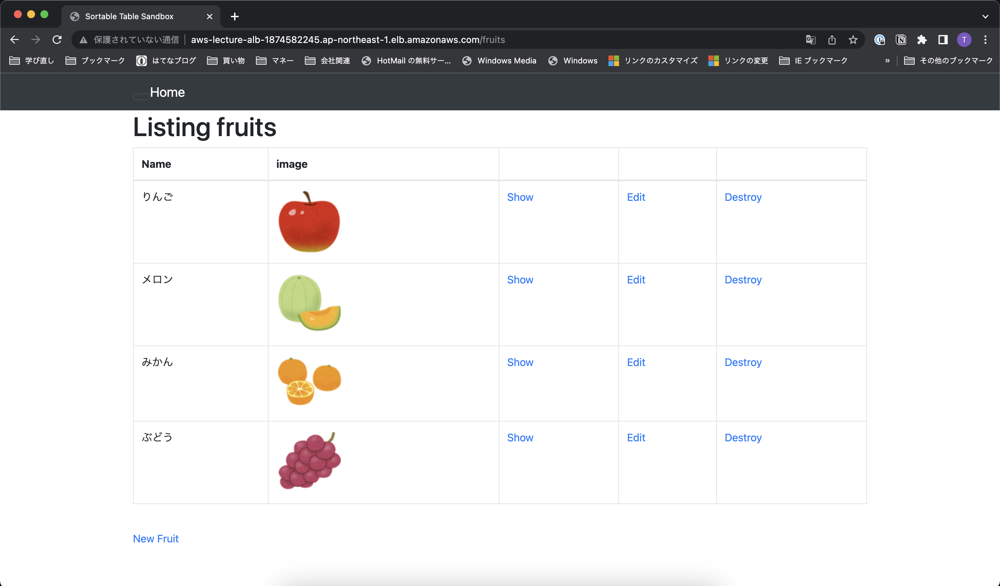

    - バケットに保存されていることを確認
    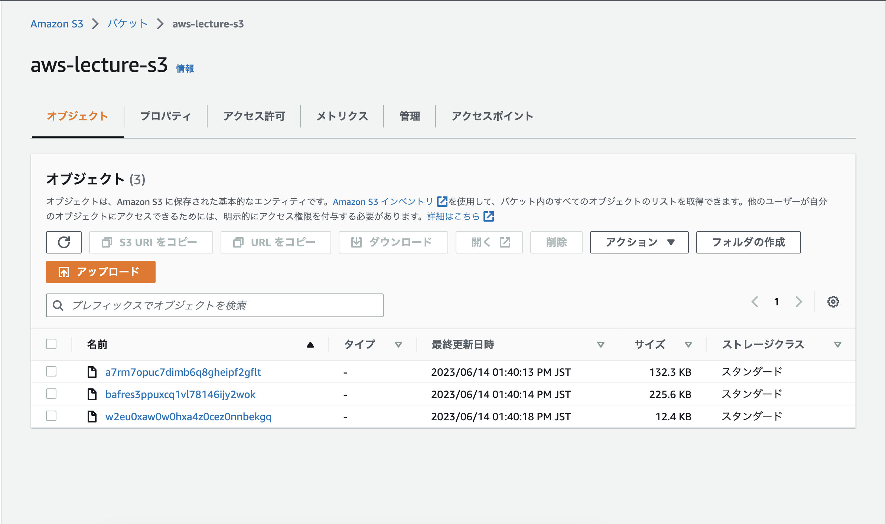

## 環境を構成図に書き起こす
- 書き起こした構成図
    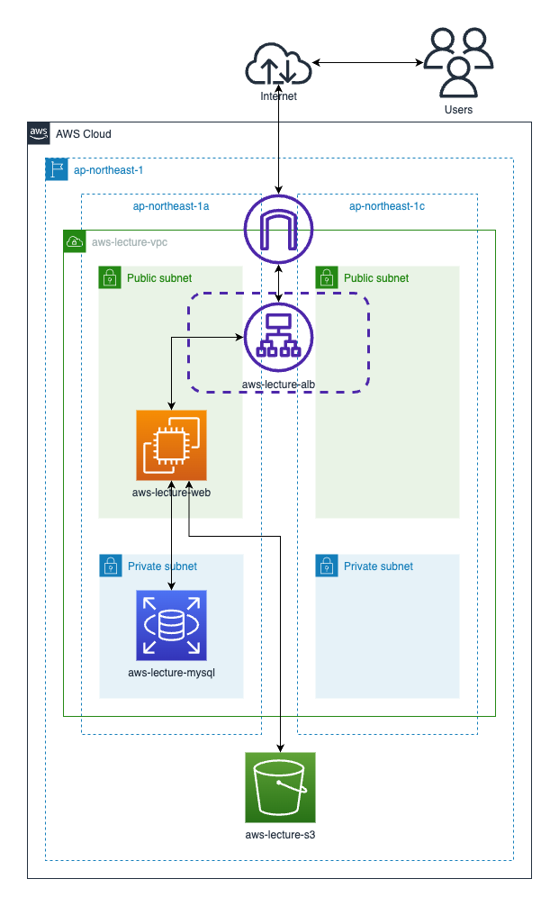

## 今回の課題から学んだことを報告する
- サーバやDBがウィザードだけで簡単に作成できたことに改めて驚いた
- 特にインターネットにつながるネットワークがAWSにほぼお任せでできることに驚き
- 次はサブネットやセキュリティグループを自分で作成後に関連付けてみて理解を深めたい
