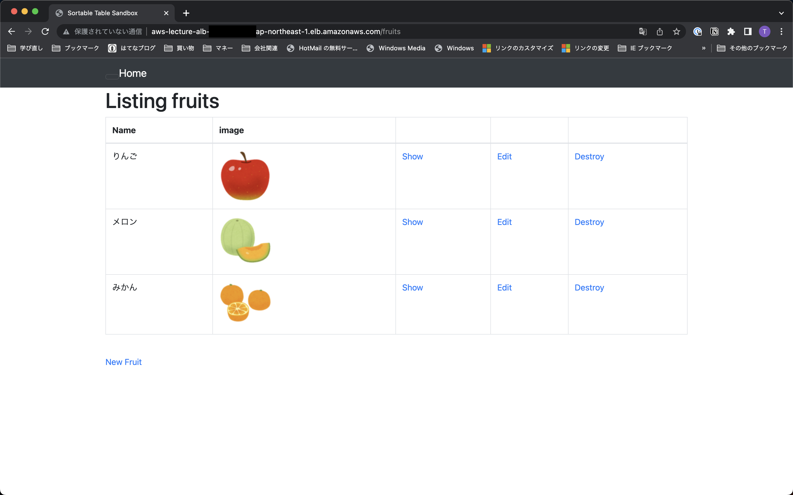

# 第5回課題

## EC2上にサンプルアプリケーションをデプロイして、動作させる
### 組み込みサーバーだけで動作させる
1. サンプルアプリケーションで指定された動作環境を構築する
    - Ruby(3.1.2)をインストール

    ```
    # パッケージをアップデート
    $ sudo yum update -y
    
    # rbenvをインストールするためにGitをインストール
    $ sudo yum install git
    
    # '~/.rbenv'内に、rbenvをチェックアウト
    $ git clone https://github.com/sstephenson/rbenv.git ~/.rbenv
    
    # '~/.rbenv/bin'を'$PATH'に追加
    $ echo 'export PATH="$HOME/.rbenv/bin:$PATH"' >> ~/.bash_profile
    
    # 'rbenv init'をシェルに追加
    $ echo 'eval "$(rbenv init -)"' >> ~/.bash_profile
    
    # PATHの変更を有効にするために、シェルを再起動
    
    # rbenvプラグインとしてruby-buildをインストール
    $ git clone https://github.com/sstephenson/ruby-build.git ~/.rbenv/plugins/ruby-build
    
    # 推奨されるパッケージをインストール
    $ sudo yum install -y gcc-6 patch bzip2 openssl-devel libyaml-devel libffi-devel readline-devel zlib-devel gdbm-devel ncurses-devel
    # Rubyのインストールでエラーが出たため追加でインストール
    $ sudo yum -y install gcc-c++ make patch git curl zlib-devel openssl-devel ImageMagick-devel readline-devel libcurl-devel libffi-devel libicu-devel libxml2-devel libxslt-devel
    
    # Ruby(3.1.2)をインストール
    $ rbenv install 3.1.2
    ```
    
    - Rails(7.0.4)をインストール
    
    ```
    $ gem install rails -v 7.0.4
    ```
    
    - Node(17.9.1)をインストール
    
    ```
    # nvmをインストール
    $ curl -o- https://raw.githubusercontent.com/nvm-sh/nvm/v0.39.3/install.sh | bash
    
    # nvmを有効化
    $ . ~/.nvm/nvm.sh
    
    # Node(17.9.1)をインストール
    $ nvm install 17.9.1
    ```
    
    - yarnをインストール
    
    ```
    $ npm install --global yarn
    ```
    
    - Bundler(2.3.14)をインストール
    
    ```
    $ gem install bundler:2.3.14
    ```
    
    - サンプルアプリケーションのクローン
    
    ```
    $ sudo mkdir /var/www
    $ sudo chown ec2-user:ec2-user /var/www
    $ cd /var/www
    $ git clone https://github.com/yuta-ushijima/raisetech-live8-sample-app.git
    ```
    
    - database.ymlの作成
    
    ```
    $ cd raisetech-live8-sample-app/config/
    $ cp database.yml.sample database.yml
    $ vim database.yml
    default: &default
      adapter: mysql2
      encoding: utf8mb4
      pool: <%= ENV.fetch("RAILS_MAX_THREADS") { 5 } %>
      username: RDS作成時に設定したユーザー
      password: RDS作成時に設定したパスワード
      host:     RDSのエンドポイント
    
    development:
      <<: *default
      database: raisetech_live8_sample_app_development
    #  socket: /tmp/mysql.sock
    
    test:
      <<: *default
      database: raisetech_live8_sample_app_test
    #  socket: /tmp/mysql.sock

    ```
    
    - MySQLクライアントをインストール
    
    ```
    # サンプルアプリケーションのREADMEに記載の手順を参考にインストール
    
    # mariadbがある場合を想定して先に削除
    $ sudo yum remove -y mysql-server
    $ sudo yum remove -y mariadb*
    
    # GPGキーの更新
    $ sudo rpm --import https://repo.mysql.com/RPM-GPG-KEY-mysql-2022
    
    # 
    $ curl https://dev.mysql.com/downloads/repo/yum/ | grep el7 | cut -d'(' -f2 | cut -d')' -f1
    $ sudo wget https://dev.mysql.com/get/上記コマンドで出力された文字列 -O /tmp/mysql.rpm
    $ sudo yum localinstall -y /tmp/mysql.rpm
    $ sudo yum install -y mysql-community-client
    $ sudo yum install -y mysql-community-devel
    $ sudo rm -f /tmp/mysql.rpm
    ```
    
    - サンプルアプリケーションの環境構築コマンドを実行
    
    ```
    $ bin/setup
    ```
    
    - サンプルアプリケーションの起動
    
    ```
    $ bin/dev
    ```
    
    - EC2のセキュリティグループに80、3000番ポートを許可するルールを追加
    


2. New Fruitから入力し反映されることを確認する
    - New Fruitから入力し反映されることを確認
    

### サーバーアプリケーションを分ける
1. Nginxをインストールする
    - Nginxをインストール
    
    ```
    $ sudo amazon-linux-extras install -y nginx1
    ```

    - Nginxの起動を確認
    
    ```
    # Nginxの起動
    $ sudo systemctl start nginx
    ```
    

    ```
    # Nginxの起動
    $ sudo systemctl start nginx
    ```
    
2. Railsの設定を変更する
    - サンプルアプリケーションのGemfileに`unicorn`が記述されていることを確認
    - `unicorn.rb`を編集
    
    ```
    $ cd /var/www/raisetech-live8-sample-app/config/
    $ vim unicorn.rb
    # 以下内容に変更する
    listen '/var/www/raisetech-live8-sample-app/unicorn.sock'
    pid    '/var/www/raisetech-live8-sample-app/unicorn.pid'
    ```

    - 設定ファイルを作成    
    
    ```
    $ cd /etc/nginx/conf.d
    $ sudo vim rails.conf
    upstream unicorn {
      server unix:/var/www/raisetech-live8-sample-app/unicorn.sock;
    }
    
    server {
      listen 80;
      # server_name _;
      root /var/www/raisetech-live8-sample-app/public;
    
      location @unicorn {
        proxy_set_header X-Forwarded-For $proxy_add_x_forwarded_for;
        proxy_set_header Host $http_host;
        proxy_redirect off;
        proxy_pass http://unicorn;
      }
    
      try_files $uri/index.html $uri @unicorn;
      error_page 404 /404.html;
      error_page 422 /422.html;
      error_page 500 502 503 504 /500.html;
    }
    ```

3. New Fruitから入力し反映されることを確認する
    - NginxとUnicornを起動
    - New Fruitから入力し反映されることを確認
    

## ELB(ALB)を追加する
1. ELB(ALB)を作成する
    - ELB(ALB)が作成されていることを確認
    
    
    
    
    - ELB(ALB)のターゲットグループを確認
    
    
    - ELB(ALB)のセキュリティグループを確認
    

2. `development.rb`にELB(ALB)のDNS名を追加する
    - `development.rb`の設定を変更
    
    ```
    # 'development.rb'があるディレクトリに移動
    $ cd /var/www/raisetech-live8-sample-app/config/environments
    
    # 'development.rb'を編集
    $ vim development.rb
    
    config.hosts << "ELB(ALB)のDNS名"
    ```

3. ELB(ALB)のDNS名でアクセスできるか確認する
    - NginxとUnicornを再起動
    - DNS名でアクセスし、New Fruitから入力し反映されることを確認
    

## S3を追加する
1. バケットを作成する
    - バケットが作成されていることを確認
    

2. S3にアクセスするためのIAMユーザーを作成する
    - IAMユーザーを作成しアクセスキーが作成されていることを確認
    

3. Railsの設定を変更する
    - サンプルアプリケーションのGemfileに`aws-sdk-s3`が記述されていることを確認
    - 秘匿情報に作成したアクセスキーを設定

    ```
    # 設定ファイルがあるディレクトリに移動
    $ cd /var/www/raisetech-live8-sample-app/config/credentials/
    
    # 設定ファイルの削除
    $ rm development.yml.enc
    
    # 設定ファイルの作成
    $ EDITOR=vim rails credentials:edit --environment development
    
    aws:
      access_key_id: 作成したアクセスキーID
      secret_access_key: 作成したシークレットアクセスキー
      active_storage_bucket_name: 作成したバケットの名前
    ```

    - `development.rb`の設定を変更
    
    ```
    # 'development.rb'があるディレクトリに移動
    $ cd /var/www/raisetech-live8-sample-app/config/environments
    
    # 'development.rb'を編集
    $ vim development.rb
    
    config.active_storage.service = :amazon
    ```

4. New Fruitから入力し反映され、バケットに保存されていることを確認する
    - NginxとUnicornを再起動
    - New Fruitから入力し反映されることを確認
    

    - バケットに保存されていることを確認
    

## 環境を構成図に書き起こす


## 今回の課題から学んだことを報告する
- 時間をかけて取り組んだので、AWSのEC2やRDSで環境を構築する手順がだいぶイメージできた
- 動作環境のパッケージの前提となるパッケージがあり、その調査に時間がかかった
- ネットに情報はたくさんあるが、それらの情報の元となる情報までたどり着くのに時間がかかった
