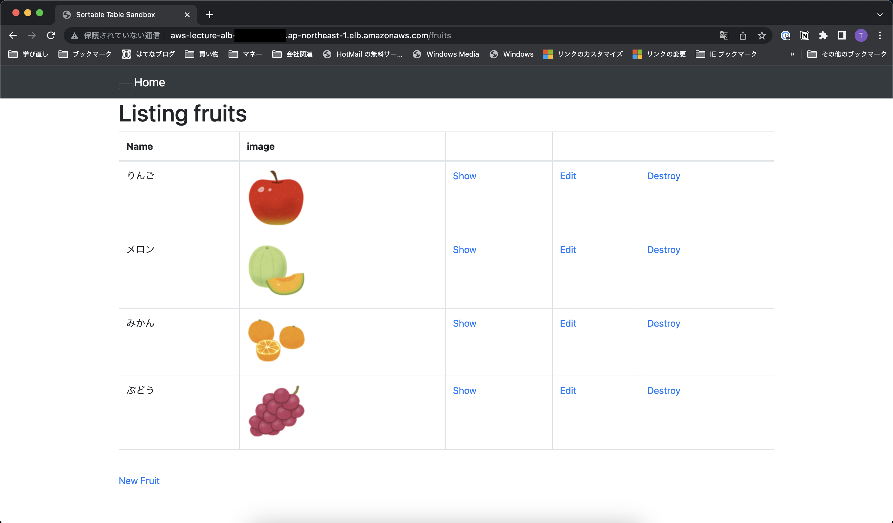

# 第5回課題

## EC2上にサンプルアプリケーションをデプロイして、動作させる
### 組み込みサーバーだけで動作させる
1. 〜
- 〜を確認


- New Fruitから入力し反映されることを確認


### サーバーアプリケーションを分ける


- Nginxが起動していることを確認


- New Fruitから入力し反映されることを確認


## ELB(ALB)を追加する
1. ELB(ALB)を作成する
    - ELB(ALB)が作成されていることを確認
    
    
    
    
    - ELB(ALB)のターゲットグループを確認
    
    
    - ELB(ALB)のセキュリティグループを確認
    

2. `development.rb`にELB(ALB)のDNS名を追加する
    - `development.rb`の設定を変更
    
    ```
    # 'development.rb'があるディレクトリに移動
    $ cd /var/www/raisetech-live8-sample-app/config/environments
    
    # 'development.rb'を編集
    $ vim development.rb
    
    config.hosts << "ELB(ALB)のDNS名"
    ```

3. ELB(ALB)のDNS名でアクセスできるか確認する
    - DNS名でアクセスし、New Fruitから入力し反映されることを確認
    

## S3を追加する
1. バケットを作成する
    - バケットが作成されていることを確認
    

2. S3にアクセスするためのIAMユーザーを作成する
    - IAMユーザーを作成しアクセスキーが作成されていることを確認
    

3. Railsの設定を変更する
    - サンプルアプリケーションのGemfileに`aws-sdk-s3`が記述されていることを確認
    - 秘匿情報に作成したアクセスキーを設定

    ```
    # 設定ファイルがあるディレクトリに移動
    $ cd /var/www/raisetech-live8-sample-app/config/credentials/
    
    # 設定ファイルの削除
    $ rm development.yml.enc
    
    # 設定ファイルの作成
    $ EDITOR=vim rails credentials:edit --environment development
    
    aws:
      access_key_id: 作成したアクセスキーID
      secret_access_key: 作成したシークレットアクセスキー
      active_storage_bucket_name: 作成したバケットの名前
    ```

    - `development.rb`の設定を変更
    
    ```
    # 'development.rb'があるディレクトリに移動
    $ cd /var/www/raisetech-live8-sample-app/config/environments
    
    # 'development.rb'を編集
    $ vim development.rb
    
    config.active_storage.service = :amazon
    ```

4. New Fruitから入力し反映され、バケットに保存されていることを確認する
    - New Fruitから入力し反映されることを確認
    

    - バケットに保存されていることを確認
    

## 環境を構成図に書き起こす


## 今回の課題から学んだことを報告する
- サーバやDBがウィザードだけで簡単に作成できたことに改めて驚いた
- 特にインターネットにつながるネットワークがAWSにほぼお任せでできることに驚き
- 次はサブネットやセキュリティグループを自分で作成後に関連付けてみて理解を深めたい
