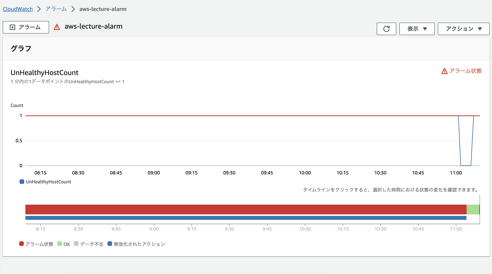

# 第6回課題

## 最後にAWSを利用した日の記録をCloudTrailのイベントから探し出す
- CloudTrailのイベント履歴から自分のIAMユーザーで最後に利用した日のイベントを確認

- イベント名と、含まれている内容3つをピックアップ
    - イベント名：StartSession
    - 含まれている内容
        - イベント時間
        - 発信元IPアドレス
        - イベントレコード

## CloudWatchアラームを使って、ALBのアラームを設定し、メール通知する
### アラームとアクションを設定する
- ALBのターゲットグループが「正常」「異常」を監視するアラームを設定
- SNSでメールを送信するアクションを設定

### Railsアプリケーションが使えない状態で動作を確認する
- Nginxを停止
- ターゲットグループのヘルスステータスが「異常」になっていることを確認

- CloudWatchでアラーム状態になっていることを確認

- SNSで指定したメールアドレス宛にメールが届いていることを確認

### Railsアプリケーションが使える状態で動作を確認する
- Nginxを起動
- ターゲットグループのヘルスステータスが「正常」になっていることを確認

- CloudWatchでOK状態になっていることを確認

- SNSで指定したメールアドレス宛にメールが届いていることを確認

## AWS利用料の見積を作成する
- 今日までに作成したリソースの内容の見積 
[My Estimate](https://calculator.aws/#/estimate?id=08f16b517723506f91ca8c3a65e99ab34f193f0b)

## マネジメントコンソールから、現在の利用料を確認する
- 先月の請求情報から、EC2の料金がいくらか、無料利用枠で収まっているか確認

## 今回の課題から学んだことを報告する
- AWSだけでログ出力や監視・通知などができることに驚いた
- 有効化しないと出力されないログがあるので設定を忘れないようにしたい
- バッチジョブやジョブの実行監視などのAWSでのセオリーが気になった