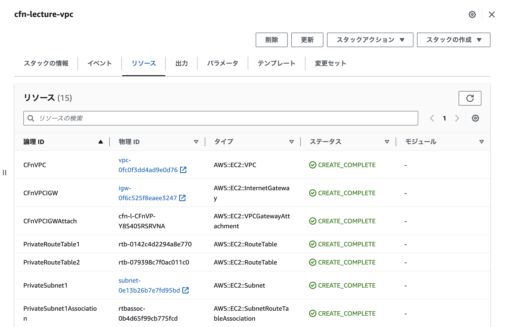
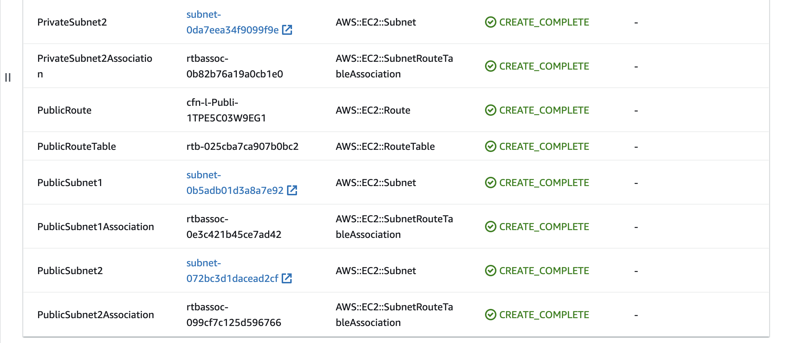
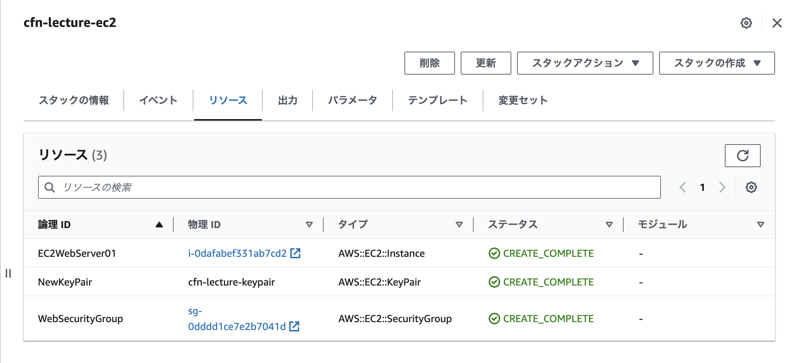
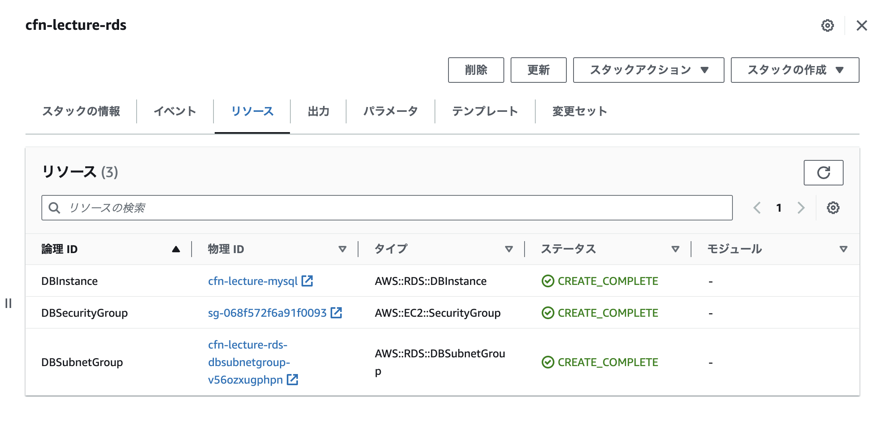
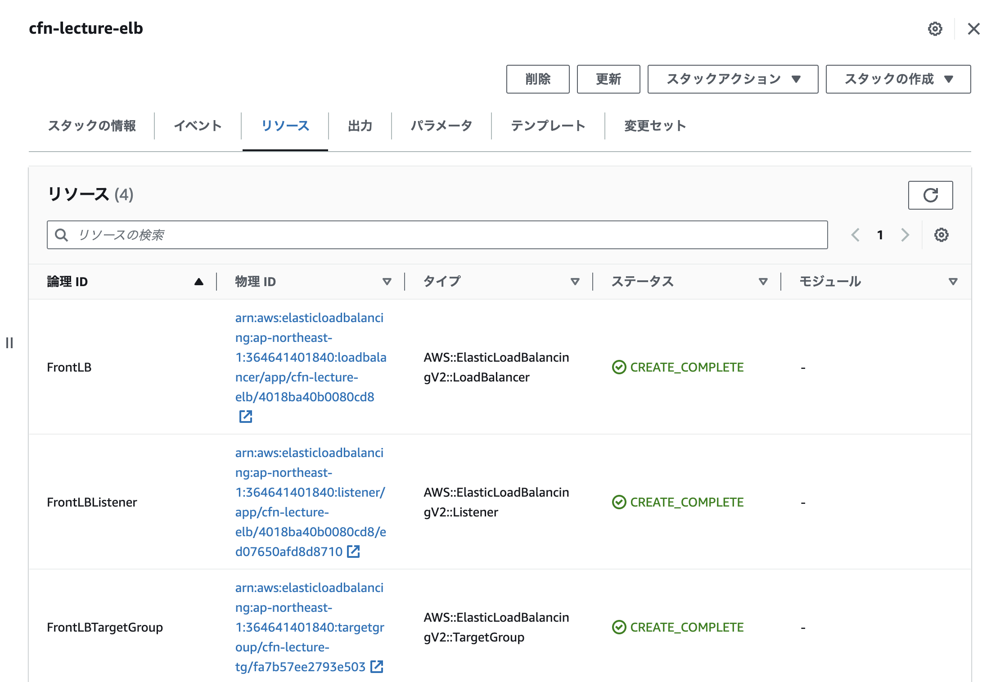
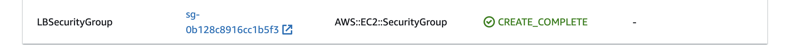
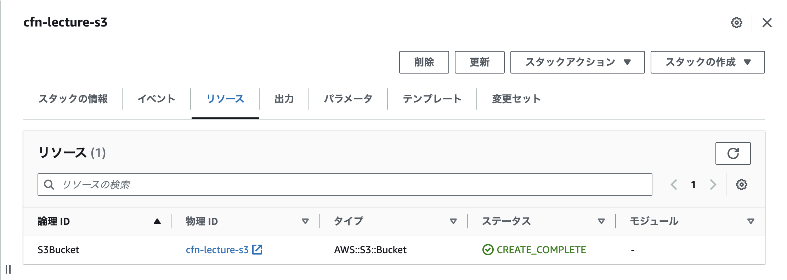
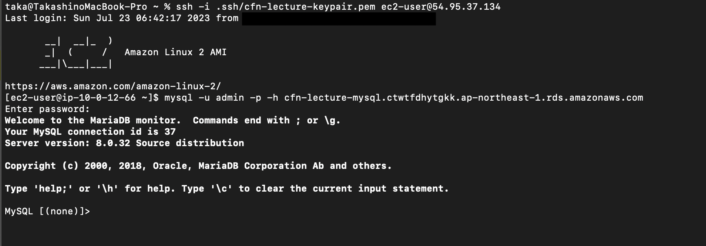

# 第10回課題

## 課題
> CloudFormation を利用して、現在までに作った環境をコード化しましょう。<br>
> コード化ができたら実行してみて、環境が自動で作られることを確認してください。

## テーマ
- 課題に取り組むにあたり、以下のテーマを設定する
    - 各リソースのウィザードで作成した時に指定した内容を、コードでも同様に指定する
    - 理由：ウィザードとコードでの違いを比較することで理解が深まることを期待

## 結果
### CloudFormation を利用して、現在までに作った環境をコード化する
- 01_vpc.yml を作成
    - VPC 関連のテンプレート
    - VPC、Subnet、InternetGateway、RouteTable をコード化

```
# 一部抜粋（詳細はCloudFormationディレクトリのYAMLファイルを参照）

Resources:
# ------------------------------------------------------------#
#  VPC
# ------------------------------------------------------------#
  CFnVPC:
    Type: AWS::EC2::VPC
    Properties:
      CidrBlock: 10.0.0.0/16
      InstanceTenancy: default
      EnableDnsSupport: true
      EnableDnsHostnames: true
      Tags:
        - Key: Name
          Value: !Sub ${Project}-vpc

# ------------------------------------------------------------#
#  Subnet
# ------------------------------------------------------------#
  PublicSubnet1:
    Type: AWS::EC2::Subnet
    Properties:
      CidrBlock: 10.0.0.0/20
      VpcId: !Ref CFnVPC
      AvailabilityZone: !Ref AZ1
      Tags:
        - Key: Name
          Value: !Sub ${Project}-subnet-public1-${AZ1}

  PublicSubnet2:
    Type: AWS::EC2::Subnet
    Properties:
      CidrBlock: 10.0.16.0/20
      VpcId: !Ref CFnVPC
      AvailabilityZone: !Ref AZ2
      Tags:
        - Key: Name
          Value: !Sub ${Project}-subnet-public2-${AZ2}

  PrivateSubnet1:
    Type: AWS::EC2::Subnet
    Properties:
      CidrBlock: 10.0.128.0/20
      VpcId: !Ref CFnVPC
      AvailabilityZone: !Ref AZ1
      Tags:
        - Key: Name
          Value: !Sub ${Project}-subnet-private1-${AZ1}

  PrivateSubnet2:
    Type: AWS::EC2::Subnet
    Properties:
      CidrBlock: 10.0.144.0/20
      VpcId: !Ref CFnVPC
      AvailabilityZone: !Ref AZ2
      Tags:
        - Key: Name
          Value: !Sub ${Project}-subnet-private2-${AZ2}

# ------------------------------------------------------------#
#  InternetGateway
# ------------------------------------------------------------#
  CFnVPCIGW:
    Type: AWS::EC2::InternetGateway
    Properties: 
      Tags:
        - Key: Name
          Value: !Sub ${Project}-igw

  CFnVPCIGWAttach:
    Type: AWS::EC2::VPCGatewayAttachment
    Properties: 
      InternetGatewayId: !Ref CFnVPCIGW
      VpcId: !Ref CFnVPC

# ------------------------------------------------------------#
#  RouteTable
# ------------------------------------------------------------#
  PublicRouteTable:
    Type: AWS::EC2::RouteTable
    Properties:
      VpcId: !Ref CFnVPC
      Tags:
        - Key: Name
          Value: !Sub ${Project}-rtb-public

  PublicRoute:
    Type: AWS::EC2::Route
    DependsOn: CFnVPCIGW
    Properties:
      RouteTableId: !Ref PublicRouteTable
      DestinationCidrBlock: 0.0.0.0/0
      GatewayId: !Ref CFnVPCIGW

  PublicSubnet1Association:
    Type: AWS::EC2::SubnetRouteTableAssociation
    Properties:
      SubnetId: !Ref PublicSubnet1
      RouteTableId: !Ref PublicRouteTable

  PublicSubnet2Association:
    Type: AWS::EC2::SubnetRouteTableAssociation
    Properties:
      SubnetId: !Ref PublicSubnet2
      RouteTableId: !Ref PublicRouteTable

  PrivateRouteTable1:
    Type: AWS::EC2::RouteTable
    Properties:
      VpcId: !Ref CFnVPC
      Tags:
        - Key: Name
          Value: !Sub ${Project}-rtb-private1-${AZ1}

  PrivateSubnet1Association:
    Type: AWS::EC2::SubnetRouteTableAssociation
    Properties:
      SubnetId: !Ref PrivateSubnet1
      RouteTableId: !Ref PrivateRouteTable1

  PrivateRouteTable2:
    Type: AWS::EC2::RouteTable
    Properties:
      VpcId: !Ref CFnVPC
      Tags:
        - Key: Name
          Value: !Sub ${Project}-rtb-private2-${AZ2}

  PrivateSubnet2Association:
    Type: AWS::EC2::SubnetRouteTableAssociation
    Properties:
      SubnetId: !Ref PrivateSubnet2
      RouteTableId: !Ref PrivateRouteTable2
```

- 02_ec2.yml を作成
    - EC2 関連のテンプレート
    - KeyPair、SecurityGroup、EC2 をコード化
    - SSH のインバウンドルールに指定するマイIPは「x.x.x.x/x」としておき、スタック作成時に画面から入力

```
# 一部抜粋（詳細はCloudFormationディレクトリのYAMLファイルを参照）

Resources:
# ------------------------------------------------------------#
#  KeyPair
# ------------------------------------------------------------#
  NewKeyPair:
    Type: 'AWS::EC2::KeyPair'
    Properties:
      KeyName: !Sub ${Project}-keypair

# ------------------------------------------------------------#
#  SecurityGroup
# ------------------------------------------------------------#
  WebSecurityGroup:
    Type: AWS::EC2::SecurityGroup
    Properties: 
      GroupDescription: !Sub ${Project}-sg-web created
      GroupName: !Sub ${Project}-sg-web
      VpcId:
        Fn::ImportValue: !Sub ${VPCStack}-VPCID
      SecurityGroupIngress:
        - IpProtocol: tcp
          FromPort: 80
          ToPort: 80
          CidrIp: 0.0.0.0/0
        - IpProtocol: tcp
          FromPort: 3000
          ToPort: 3000
          CidrIp: 0.0.0.0/0
        - IpProtocol: tcp
          FromPort: 22
          ToPort: 22
          CidrIp: !Ref SSHCidrIp

# ------------------------------------------------------------#
#  EC2
# ------------------------------------------------------------#
  EC2WebServer01:
    Type: AWS::EC2::Instance
    Properties:
      ImageId: !Ref EC2AMI
      InstanceType: t2.micro
      KeyName: !Ref NewKeyPair
      NetworkInterfaces:
        - AssociatePublicIpAddress: true
          DeviceIndex: 0
          GroupSet:
           - !Ref WebSecurityGroup
          SubnetId: 
            Fn::ImportValue: !Sub ${VPCStack}-PublicSubnet1
      BlockDeviceMappings: 
        - DeviceName: "/dev/xvda"
          Ebs: 
            VolumeSize: 8
            VolumeType: "gp2"
      Tags:
        - Key: Name
          Value: !Sub ${Project}-web
```

- 03_rds.yml を作成
    - RDS 関連のテンプレート
    - SubnetGroup、SecurityGroup、RDS をコード化
    - DB のパスワードは「xxxxxxxx」としておき、スタック作成時に画面から入力

```
# 一部抜粋（詳細はCloudFormationディレクトリのYAMLファイルを参照）

Resources:
# ------------------------------------------------------------#
#  SubnetGroup
# ------------------------------------------------------------#
  DBSubnetGroup: 
    Type: AWS::RDS::DBSubnetGroup
    Properties: 
      DBSubnetGroupDescription: DB Subnet Group for Private Subnet
      SubnetIds: 
        - Fn::ImportValue: !Sub ${VPCStack}-PrivateSubnet1
        - Fn::ImportValue: !Sub ${VPCStack}-PrivateSubnet2

# ------------------------------------------------------------#
#  SecurityGroup
# ------------------------------------------------------------#
  DBSecurityGroup:
    Type: AWS::EC2::SecurityGroup
    Properties: 
      GroupDescription: Created by CFn
      GroupName: !Sub ${Project}-sg-db
      VpcId:
        Fn::ImportValue: !Sub ${VPCStack}-VPCID
      SecurityGroupIngress:
        - IpProtocol: tcp
          FromPort: 3306
          ToPort: 3306
          SourceSecurityGroupId: 
            Fn::ImportValue: !Sub ${EC2Stack}-WebSecurityGroup

# ------------------------------------------------------------#
#  RDS
# ------------------------------------------------------------#
  DBInstance:
    Type: AWS::RDS::DBInstance
    DeletionPolicy: Delete
    Properties:
      Engine: MySQL
      EngineVersion: 8.0.32
      DBInstanceIdentifier: !Sub ${Project}-mysql
      MasterUsername: !Ref DBUser
      MasterUserPassword: !Ref DBPassword
      DBInstanceClass: db.t2.micro
      StorageType: gp2
      AllocatedStorage: "20"
# ストレージの自動スケーリング
# EC2 コンピューティングリソースに接続しない
      NetworkType: IPV4
      DBSubnetGroupName: !Ref DBSubnetGroup
      PubliclyAccessible: false
      VPCSecurityGroups:
        - !Ref DBSecurityGroup
      AvailabilityZone: !Ref RDSAZ
# RDS Proxy
# 認証機関
# モニタリング
      BackupRetentionPeriod: 0
```

- 04_elb.yml を作成
    - ELB 関連のテンプレート
    - SecurityGroup、LoadBalancer をコード化

```
# 一部抜粋（詳細はCloudFormationディレクトリのYAMLファイルを参照）

Resources:
# ------------------------------------------------------------#
#  SecurityGroup
# ------------------------------------------------------------#
  LBSecurityGroup:
    Type: AWS::EC2::SecurityGroup
    Properties: 
      GroupDescription: !Ref AWS::StackName
      VpcId:
        Fn::ImportValue: !Sub ${VPCStack}-VPCID
      SecurityGroupIngress:
        - IpProtocol: tcp
          FromPort: 80
          ToPort: 80
          CidrIp: 0.0.0.0/0

# ------------------------------------------------------------#
#  LoadBalancer
# ------------------------------------------------------------#
  FrontLB:
    Type: AWS::ElasticLoadBalancingV2::LoadBalancer
    Properties:
      Name: !Ref AWS::StackName
      Scheme: internet-facing
      IpAddressType: ipv4
      Subnets:
        - Fn::ImportValue: !Sub ${VPCStack}-PublicSubnet1
        - Fn::ImportValue: !Sub ${VPCStack}-PublicSubnet2
      SecurityGroups: 
        - !Ref LBSecurityGroup

  FrontLBTargetGroup:
    Type: AWS::ElasticLoadBalancingV2::TargetGroup
    Properties:
      TargetType: instance
      Name: !Sub ${Project}-tg
      Protocol: HTTP
      Port: 80
      VpcId:
        Fn::ImportValue: !Sub ${VPCStack}-VPCID
      ProtocolVersion: HTTP1
      HealthCheckProtocol: HTTP
      HealthCheckPath: /
      Targets:
        - Id:
            Fn::ImportValue: !Sub ${EC2Stack}-EC2WebServer01

  FrontLBListener:
    Type: AWS::ElasticLoadBalancingV2::Listener
    Properties:
      LoadBalancerArn: !Ref FrontLB
      Port: 80
      Protocol: HTTP 
      DefaultActions: 
        - Type: forward
          TargetGroupArn: !Ref FrontLBTargetGroup
```

- 05_s3.yml を作成
    - S3 のテンプレート
    - S3 をコード化

```
# 一部抜粋（詳細はCloudFormationディレクトリのYAMLファイルを参照）

Resources:
# ------------------------------------------------------------#
#  Bucket
# ------------------------------------------------------------#
  S3Bucket:
    Type: 'AWS::S3::Bucket'
    Properties:
      BucketName: !Sub ${Project}-s3
# AWS リージョン
      OwnershipControls:
        Rules:
          - ObjectOwnership: BucketOwnerEnforced
      PublicAccessBlockConfiguration:
        BlockPublicAcls: False
        BlockPublicPolicy: False
        IgnorePublicAcls: False
        RestrictPublicBuckets: False
      VersioningConfiguration:
        Status: Suspended
      BucketEncryption:
        ServerSideEncryptionConfiguration:
        - ServerSideEncryptionByDefault:
            SSEAlgorithm: AES256
          BucketKeyEnabled: True
```

### コード化できたら実行し、環境が自動で作られることを確認する
- 01_vpc.yml の実行結果


- 02_ec2.yml の実行結果

- 03_rds.yml の実行結果

- 04_elb.yml の実行結果


- 05_s3.yml の実行結果


### おまけ
- EC2にSSH接続でき、EC2からRDSに接続できることを確認
    - 事前に以下手順を実施済み
        - ローカルにSSH接続用のキーを作成
        - EC2にmysqlをインストール
    - 接続確認


## 今回の課題から学んだことを報告する
- ウィザードでは気づかなかったが、コード化することで構造がより理解できた
- RDSのウィザードでは指定した項目でコードでの指定方法がわからないものがあった
    - 結果は一致していたため、指定は不要とした
    - YAMLファイルにはコメントとして記載
- 今後、CloudFormationのベストプラクティスについて勉強していきたい
