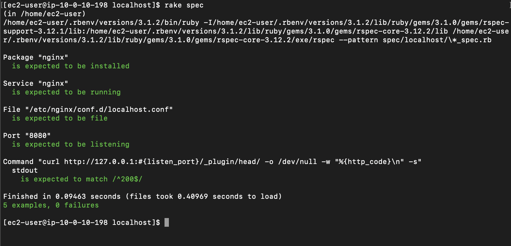

# 第11回課題

## 課題
> ServerSpec のテストが成功することを追加課題とします。<br>
> サンプルを提供しますので、本日の授業を参考にカスタマイズしてみてください。<br>
> テスト定義には決まった答えはないので、自由な発想で色々試してみましょう。

## 事前準備
- 第10回課題でCloudFormationを使い作成したEC2に以下作業を手動で実施
  - Serverspecを動かすため、`rbenv`で`Ruby`をインストール
  - サンプルに定義されているテストを実施するため、`Nginx`をインストール
  - `Nginx`を8080ポートで起動するために、`/etc/nginx/conf.d/localhost.conf`を作成

```
$ sudo cat /etc/nginx/conf.d/localhost.conf 
server {
  listen 8080;
  server_name localhost;
}
```

## テスト観点
- CloudFormationで作成したEC2に対して、手動で実施した作業をServerspecで確認する
  - RubyのインストールはServerspecが動くことで確認できるためテストケースから除外する
- エラー時にエラー箇所がわかりやすいように細かく設定する

## 結果
### Serverspecのサンプルをカスタマイズし、テストが成功することを確認する
- 第10回課題で作成したEC2にServerspecをインストール＆初期設定

```
$ gem install serverspec

$ serverspec-init
Select OS type:

  1) UN*X
  2) Windows

Select number: 1

Select a backend type:

  1) SSH
  2) Exec (local)

Select number: 2

 + spec/
 + spec/localhost/
 + spec/localhost/sample_spec.rb
/home/ec2-user/.rbenv/versions/3.1.2/lib/ruby/gems/3.1.0/gems/serverspec-2.42.2/lib/serverspec/setup.rb:155: warning: Passing safe_level with the 2nd argument of ERB.new is deprecated. Do not use it, and specify other arguments as keyword arguments.
/home/ec2-user/.rbenv/versions/3.1.2/lib/ruby/gems/3.1.0/gems/serverspec-2.42.2/lib/serverspec/setup.rb:155: warning: Passing trim_mode with the 3rd argument of ERB.new is deprecated. Use keyword argument like ERB.new(str, trim_mode: ...) instead.
 + spec/spec_helper.rb
 + Rakefile
 + .rspec
```

- sample_spec.rbをサンプルの内容で置き換え

- sample_spec.rbをカスタマイズ
  - 以下のテストを追加
    - Nginxが起動していることを確認
    - Nginxの設定ファイルが存在することを確認

```
[ec2-user@ip-10-0-10-198 localhost]$ cat sample_spec.rb 
require 'spec_helper'

listen_port = 8080

describe package('nginx') do
  it { should be_installed }
end

# （追加テスト）Nginxが起動していることを確認
describe service('nginx') do
  it { should be_running }
end

# （追加テスト）Nginxの設定ファイルが存在することを確認
describe file('/etc/nginx/conf.d/localhost.conf') do
  it { should be_file }
end

describe port(listen_port) do
  it { should be_listening }
end

describe command('curl http://127.0.0.1:#{listen_port}/_plugin/head/ -o /dev/null -w "%{http_code}\n" -s') do
  its(:stdout) { should match /^200$/ }
end
```

### テストが成功することを確認する
- 01_vpc.yml の実行結果


## 今回の課題から学んだことを報告する
- サーバーのテストについて一般的にをどのような観点で実施しているか知ることができた
  - 「パッケージがインストールされているか」、「ポートがリッスンしているか」など
- ServerspecはRubyのテストツールRSpecが使われいるため、Rubyも併せて理解したい
- 今後、いろいろなパターンのテストを試してみたい
