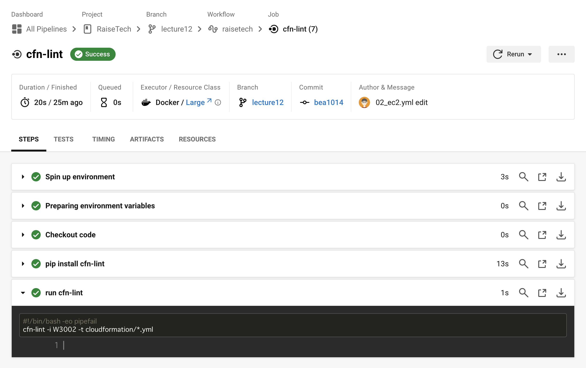

# 第11回課題

## 課題
> CircleCI のサンプルコンフィグを提供しますので、これが正しく動作するようにリポジトリに組み込んでください。

## 事前準備
- CircleCIのアカウントを作成し、GitHubと連携

## 結果
### CircleCI のサンプルコンフィグをリポジトリに組み込む
1. `.circleci/config.yml`をサンプルコンフィグの内容で置き換え
2. GitHubにプッシュ

### サンプルコンフィグが正しく動作していることを確認する
- CircleCIの実行結果


### （補足）発生したエラー
``` 
W3005 Obsolete DependsOn on resource (CFnVPCIGW), dependency already enforced by a "Ref" at Resources/PublicRoute/Properties/GatewayId/Ref
cloudformation/01_vpc.yml:102:5
```
- `Ref`の指定で依存関係が適用されているため`DependsOn`は不要
  - （対応）`DependsOn`の指定を削除

```
W2031 You must specify a valid Default value for SSHCidrIp (x.x.x.x/x). Valid values must match pattern x.x.x.x/y
cloudformation/02_ec2.yml:16:5
```
- `SSHCidrIp`に指定されているデフォルト値が`x.x.x.x/y`のパターンに一致しない
  - （対応）デフォルト値を`255.255.255.255/32`に変更

## 今回の課題から学んだことを報告する
- CircleCIとGitHubがどのように連携して動いているのかイメージできた
  - GitHubの`.circleci/config.yml`に実行したいjobを定義することで、CircleCI上で実行されるなど
- 今回は構文チェックだけだが、自動テストやビルドも試してみたい
- 公式ドキュメントが日本語化されていて内容も充実してそうなので、どんなことができるか確認したい
