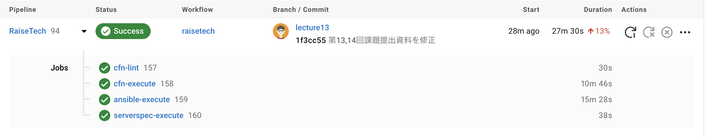
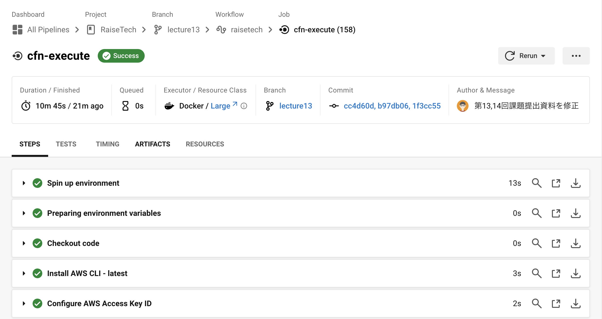
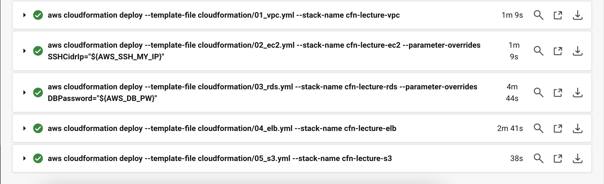
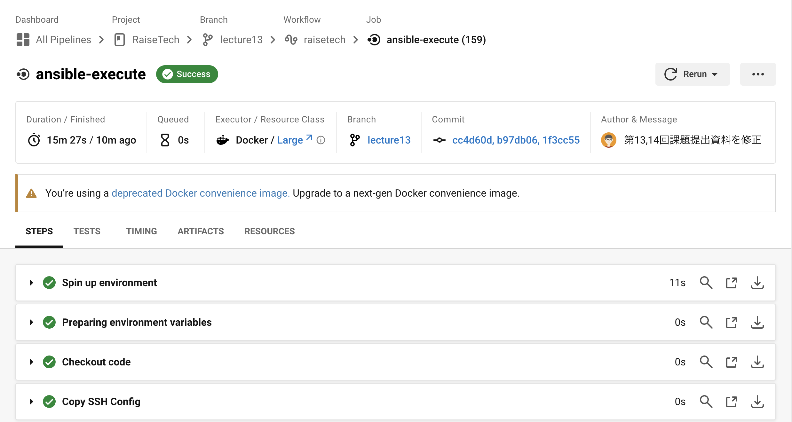
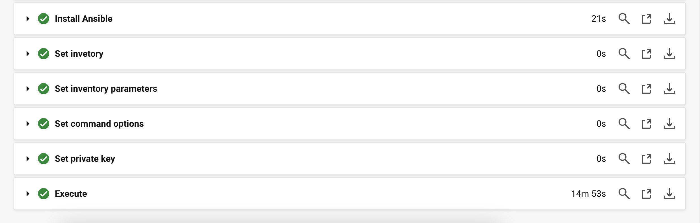
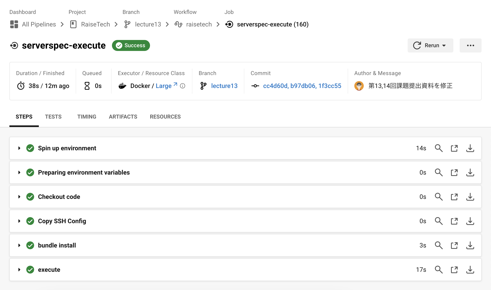
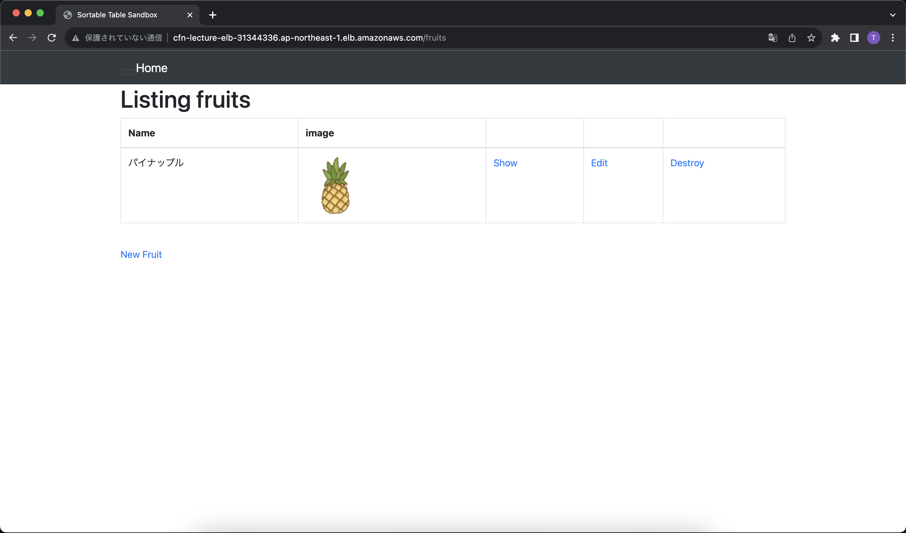
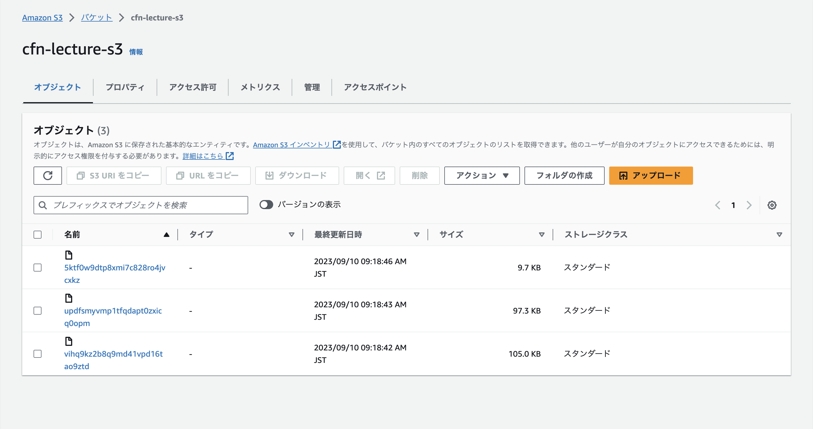
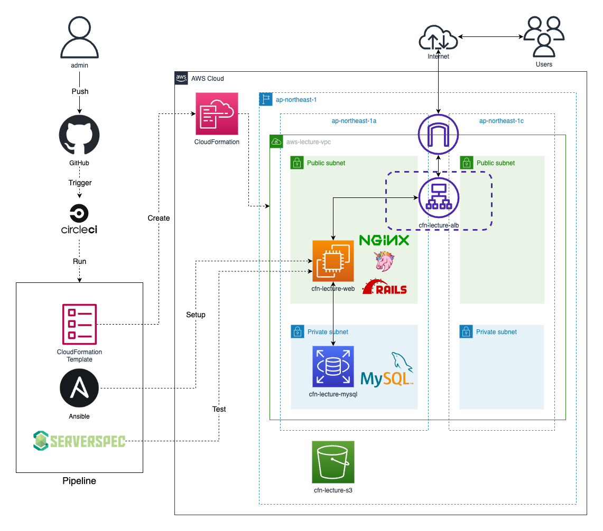

# 第13,14回課題

## 課題
### 第13回課題
> CircleCI のサンプルに ServerSpec や Ansible の処理を追加してください。
### 第14回課題
> これまでの AWS 構成図、自動化処理がわかる図、リポジトリの README を作りましょう。

## 対応内容
- 第12回課題のCircleCIに以下処理を追加
  - 第10回課題で作成したCloudFormationテンプレートを実行する処理
  - 第5回課題で実施したサンプルアプリケーションのデプロイをコード化したAnsibleの処理
  - 第11回課題で作成したServerspecのテストスクリプトをSSH実行するようにした処理
- 第5回課題で作成したAWS構成図に自動化処理の図を追加
- リポジトリのREADMEを作成

## 補足
- 必要な環境変数はCircleCIの `Environment Variables` に追加しておく
- CircleCIからEC2へのSSH接続に必要な情報は `sshconfig/config` に記載し、実行時 `~/.ssh` にコピーする

## 結果
### CircleCIにCloudFormation、Ansible、Serverspecの処理を追加する
- `.circleci/config.yml` にAWS CLIでCloudFormationテンプレートを実行する処理を追加
```
# 一部抜粋

jobs:

  cfn-execute:
    executor: aws-cli/default
    steps:
      - checkout
      - aws-cli/setup:
          aws-access-key-id: AWS_ACCESS_KEY_ID
          aws-region: AWS_DEFAULT_REGION
          aws-secret-access-key: AWS_SECRET_ACCESS_KEY
      - run: aws cloudformation deploy --template-file cloudformation/01_vpc.yml --stack-name cfn-lecture-vpc
      - run: aws cloudformation deploy --template-file cloudformation/02_ec2.yml --stack-name cfn-lecture-ec2 --parameter-overrides SSHCidrIp="${AWS_SSH_MY_IP}"
      - run: aws cloudformation deploy --template-file cloudformation/03_rds.yml --stack-name cfn-lecture-rds --parameter-overrides DBPassword="${AWS_DB_PW}"
      - run: aws cloudformation deploy --template-file cloudformation/04_elb.yml --stack-name cfn-lecture-elb
      - run: aws cloudformation deploy --template-file cloudformation/05_s3.yml --stack-name cfn-lecture-s3
```
- .circleci/config.ymlにAnsibleのPlaybookを実行する処理を追加
  - 詳細は[ansible](ansible)ディレクトリを参照
```
# 一部抜粋

jobs:

  ansible-execute:
    executor: ansible/default
    steps:
      - checkout
      - run:
          name: Copy SSH Config
          command: cp sshconfig/config ~/.ssh/
      - ansible/install:
          version: 2.9.23
      - ansible/playbook:
          playbook: ansible/playbook.yml
          playbook-options: "-i ansible/inventory"
```
- .circleci/config.ymlにServerspecのテストスクリプトを実行する処理を追加
  - 詳細は[Serverspec](serverspec)ディレクトリを参照
```
# 一部抜粋

jobs:

  serverspec-execute:
    docker:
      - image: cimg/ruby:2.7-node
    steps:
      - checkout
      - run:
          name: Copy SSH Config
          command: cp sshconfig/config ~/.ssh/
      - run:
          name: bundle install
          command: |
            cd serverspec
            gem list -e rails
            bundle install --path vendor/bundle
      - run:
          name: execute
          command: |
            cd serverspec
            bundle exec rake spec
```
### GitHubにプッシュし、CircleCIで正常終了することを確認する
- Pipelineの実行結果

- cfn-executeの実行結果


- ansible-executeの実行結果


- serverspec-executeの実行結果


### デプロイしたサンプルアプリケーションの動作確認
- ELB(ALB)のDNS名でアクセスし、New Fruitから入力し反映されることを確認

- バケットに保存されていることを確認


## 第5回課題で作成したAWS構成図に自動化処理の図を追加する


## リポジトリのREADMEを作成する
- READMEにリポジトリの説明を記載
  - 概要にRaiseTechのAWSフルコース課題提出用リポジトリの旨を記載
  - リポジトリの構成と各課題の内容を記載
  - 自動化処理を追加した構成図を記載
- 詳細は[README.md](README.md)を参照

## 今回の課題から学んだことを報告する
- 「第5回課題であんなに苦労したサンプルアプリケーションのデプロイを本当に自動化できるのか？！」という不安が大きかったが、少しでも一つずつ取り組むことでかたちにすることができ、自信につながった
- コード化することであんなに苦労したことが自動化できることに改めて衝撃を受けたと同時に「もっといろいろやってみたい！」という気持ちが出てきた
- 今回で課題は最後だが、身に付いた学習習慣を無駄にしないようこれからも日々の学習を継続していきたい
